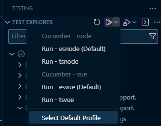
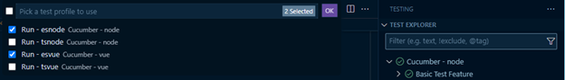
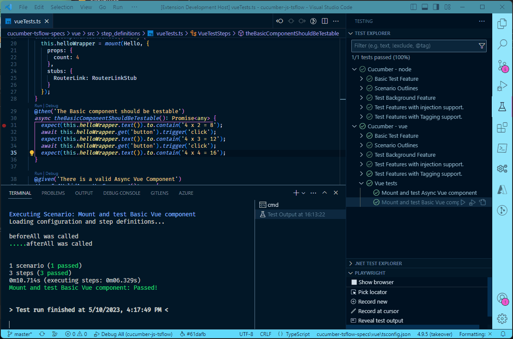

# Cucumber TsFlow for VS Code

This extension provides Run and Debug support for [cucumber-tsflow ](https://www.npmjs.com/package/@lynxwall/cucumber-tsflow) **v6.0.2** or greater in  [VS Code ](https://code.visualstudio.com/)version **1.78.0** or greater.

## Features

The latest release of this extension provides both Test Explorer and Code Lens support in VS Code to allow running and debugging Scenarios using cucumber-tsflow.

The following features have been implemented:

- **Support for multiple cucumber-tsflow test projects** - This extension will look for all cucumber configuration files and create separate run/debug profiles for each profile configuration that it finds. When a configuration has multiple profiles the Test Explorer will choose the `default` or first profile found in the associated cucumber configuration file. 

- **Ability to choose a default profile** - The Test Explorer provides an option to select a default profile that is used when running tests. The following screenshot shows the menu option provided to choose a default profile:
  

  When ***Select Default Profile*** is clicked the following dialog opens:

  
  
  **NOTE:** If multiple profiles are chosen for the same project your tests will be executed for each profile, which may not be desired.
  
- **Code Lens support** - Adds Run and Debug commands to each Given, When, Then step found in a Cucumber step file. In addition, RunAll and DebugAll commands are added to classes in a step file that are annotated with a @binding decorator.

  **NOTE**: Code Lens support will use the first (Default) profile selected for each project in the Test Explorer, shown above. If a (Default) profile isn't found it will use the cucumber `default` profile or the first profile found in the associated cucumber configuration file.

The following animation shows multiple projects with multiple profiles in each project (cucumber configuration). In addition, the animation demonstrates debugging one of the steps from the Test Explorer.

The execution of Cucumber tests is accomplished by referencing a feature or a scenario within a Cucumber Feature file.  When a step definition file is opened in VS Code, this extension will map the steps it finds with features and scenarios that you have defined. 

### Hooks (beforeAll, before, beforeStep, afterAll, after, afterStep)

This extension **does not** add Code Lens actions to cucumber-tsflow hooks. However, you can add ***breakpoints*** to code in a hook step and then ***Debug*** a scenario that should invoke the hook.

### Additional Features

- **Support for "multi-root" or "monorepo" projects** - When  a workspace with ***.feature*** files is loaded this extension will search for the first node_modules folder that contains cucumber-tsflow. From there, it will look for all cucumber configuration files and initialize a new test profile in the Test Explorer for each configuration found.
- **Uses [cucumber configuration ](https://github.com/cucumber/cucumber-js/blob/v9.1.2/docs/configuration.md) profiles to execute tests in cucumber-tsflow** - You can specify the profile to use in your tests through VS Code Test Explorer settings. The default configuration uses the `default` profile, or first one found if `default` isn't defined in your cucumber configuration.

## Future Releases

This first release focuses on providing run/debug support in step files using Code Lens in VS Code. Planned future releases will include the following:

- Code snippet generation - Currently cucumber-tsflow will generate code snippets in the terminal output when not able to find matching code for a step. This update will provide the ability to generate complete step definition files for a feature or snippets for scenarios and steps.

## Requirements

This extension requires the following:

- [cucumber-tsflow ](https://www.npmjs.com/package/@lynxwall/cucumber-tsflow) version **6.0.2** or higher.
- [vscode ](https://code.visualstudio.com/) version **1.78.0** or higher.

## Limitations

**Does not support "[ES Modules (experimental)](https://github.com/cucumber/cucumber-js/blob/v9.1.2/docs/esm.md)" in cucumber.js** - This extension will **not** look at the new **import** configuration setting that was added for ES Module support. However, both the esvue and esnode transpilers are configured for ES Module builds. In other words, there is no need to use experimental ESM support in cucumber.js when using one of these transpilers in cucumber-tsflow.

## Extension Settings

This extension should support most projects with it's default configuration. However, several configuration settings have been provided to support different project structures and cucumber configurations.

Settings for this extension all start with `cucumber-tsflow` and would normally be added to a ***settings.json*** file in your workspace under the `.vscode` folder. You can also add cucumber-tsflow settings to your global user settings.

For example, if you wanted to disable the CodeLens feature you would add the following to ***settings.json***:

`"cucumber-tsflow.disableCodeLens": true`

This extension contributes the following settings:

| Setting                   | Type    | Default                               | Description                                                  |
| ------------------------- | ------- | ------------------------------------- | ------------------------------------------------------------ |
| `configFile`              | string  |                                       | Cucumber config file (relative to cucumber-tsflow.projectPath e.g. './test/cucumber.json') |
| `projectPath`             | string  |                                       | Absolute path to project directory where packages.json and node_modules are found (e.g. /home/me/project/sub-folder) |
| `runOptions`              | array   |                                       | Add [CLI Options ](https://github.com/LynxWall/cucumber-js-tsflow#new-configuration-options) to the Cucumber-tsflow Command. (e.g. ['--backtrace', 'true']) |
| `debugOptions`            | object  |                                       | Add or overwrite vscode debug configurations (only in debug mode) (e.g. { \"args\": [\"--no-cache\"] }) |
| `disableCodeLens` | boolean | false | Disable Code Lens feature |
| `preserveEditorFocus`     | boolean | false                                 | Preserve focus on editor when running tests                  |

## Change Log

See the Change Log [here ](CHANGELOG.md)

## Issues

Submit [issues ](https://github.com/LynxWall/cucumber-tsflow-vscode/issues) if you find any bug or have any suggestions.

## Enjoy!
