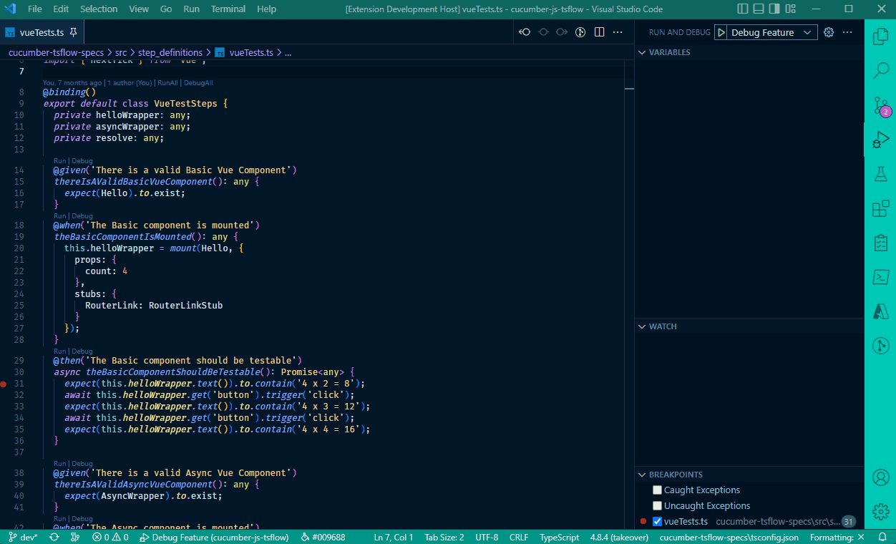

# Cucumber TsFlow for VS Code
<base target="_blank">

This extension provides Run and Debug support in Step files for [cucumber-tsflow ](https://www.npmjs.com/package/@lynxwall/cucumber-tsflow) in VS Code.

## Features

The initial release of this extension uses Code Lens support in VS Code to add Run and Debug commands to each Given, When, Then step found in a Cucumber step file. In addition, RunAll and DebugAll commands are added to classes in a step file that are annotated with a @binding decorator.

The execution of Cucumber tests is accomplished by referencing a feature or a scenario within a Cucumber Feature file.  When a step definition file is opened in VS Code, this extension will map the steps it finds with features and scenarios that you have defined. 

### Hooks (beforeAll, before, beforeStep, afterAll, after, afterStep)

This extension **does not** add Code Lens actions to cucumber-tsflow hooks. However, you can add ***breakpoints*** to code in a hook step and then ***Debug*** a scenario that should invoke the hook.

### Additional Features

- Support for "multi-root" or "monorepo" projects. When a step file is loaded the extension will search for the closest cucumber configuration file in relation to the step file. In addition, it will search up the file hierarchy for a node_modules folder that contains @lynxwall/cucumber-tsflow. You can also specify these file paths in VS Code settings.
- Uses [cucumber configuration ](https://github.com/cucumber/cucumber-js/blob/v8.0.0/docs/configuration.md) profiles to execute tests in cucumber-tsflow. You can specify the profile to use in your tests through VS Code settings. The default configuration uses the `default` profile in your cucumber configuration.

## Future Releases

This first release focuses on providing run/debug support in step files using Code Lens in VS Code. Planned future releases will include the following:

- VS Code Test Explorer integration - Organized by features -> Scenarios -> Steps.
- Code snippet generation - Currently cucumber-tsflow will generate code snippets in the terminal output when not able to find matching code for a step. This update will provide the ability to generate complete step definition files for a feature or snippets for scenarios and steps.

## Requirements

This extension requires [cucumber-tsflow ](https://www.npmjs.com/package/@lynxwall/cucumber-tsflow) version 5.1.2 or higher.

## Extension Settings

This extension should support most projects with it's default configuration. However, several configuration settings have been provided to support different project structures and cucumber configurations.

Settings for this extension all start with `cucumber-tsflow` and would normally be added to a ***settings.json*** file in your workspace under the `.vscode` folder. You can also add cucumber-tsflow settings to your global user settings.

For example, if you wanted to use a different cucumber configuration profile you would add the following to ***settings.json***:

`"cucumber-tsflow.profile": "myprofile"`

This extension contributes the following settings:

| Setting                   | Type    | Default                               | Description                                                  |
| ------------------------- | ------- | ------------------------------------- | ------------------------------------------------------------ |
| `configFile`              | string  |                                       | Cucumber config file (relative to cucumber-tsflow.projectPath e.g. './test/cucumber.json') |
| `profile`                 | string  | `default`                             | Cucumber profile to use when running or debugging tests.     |
| `cucumberPath`            | string  |                                       | Absolute path to project directory where cucumber.json is found (e.g. /home/me/project/sub-folder/test) |
| `projectPath`             | string  |                                       | Absolute path to project directory where packages.json and node_modules are found (e.g. /home/me/project/sub-folder) |
| `runOptions`              | array   |                                       | Add [CLI Options ](https://github.com/LynxWall/cucumber-js-tsflow#new-configuration-options) to the Cucumber-tsflow Command. (e.g. ['--backtrace', 'true']) |
| `debugOptions`            | object  |                                       | Add or overwrite vscode debug configurations (only in debug mode) (e.g. { \"args\": [\"--no-cache\"] }) |
| `stepsSelector`    | string  | `**/{steps,step_definitions}/**/*.ts` | Glob pattern used to find step files in your workspace. The default supports multiple test projects in a workspace. |
| `featuresSelector` | string  | `**/features/**/*.feature`            | Glob pattern used to find feature files in your workspace. The default supports multiple test projects in a workspace. |
| `preserveEditorFocus`     | boolean | false                                 | Preserve focus on editor when running tests                  |

## Change Log

See the Change Log [here ](CHANGELOG.md)

## Issues

Submit [issues ](https://github.com/LynxWall/cucumber-tsflow-vscode/issues) if you find any bug or have any suggestions.

## Enjoy!
